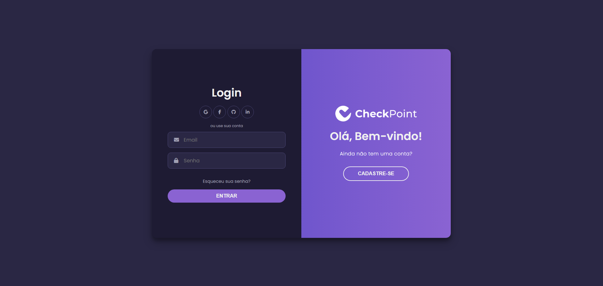
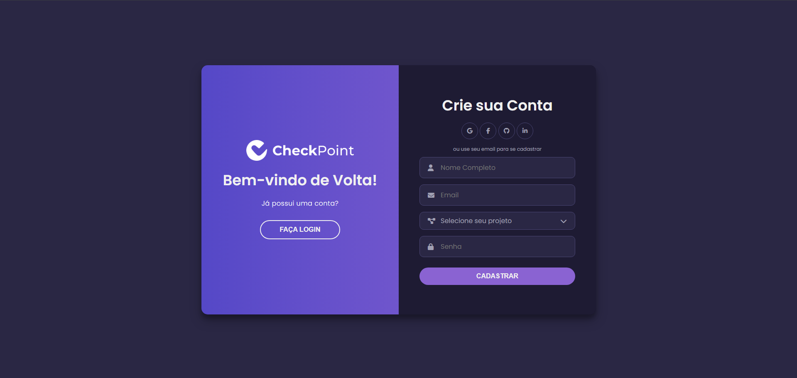

# 
  

Um protótipo de front-end completo para um sistema de gestão de frequência de alunos, projetado para ser intuitivo, moderno e rico em funcionalidades tanto para alunos quanto para gestores.

---

## 📷 Screenshots

  <strong>Tela de Login e Cadastro </strong> 

  
  

  <strong>Dashboard do Aluno</strong> 

  
   

  <strong>Painel do Gestor</strong> 

  
  

---

## ✨ Funcionalidades Principais

O sistema é dividido em duas grandes áreas: o Painel do Aluno e o Painel do Gestor.

### 🎓 Painel do Aluno
- **Login/Cadastro:** Interface moderna com animação de painel deslizante.
- **Dashboard de Início:** Saudação, cartões de estatísticas (status, horas, etc.) e gráfico de frequência semanal.
- **Check-in / Check-out:** Sistema simulado para registro de ponto.
- **Justificativas:** Modal para justificar faltas e realizar upload de atestados.
- **Minha Agenda:** Calendário visual para acompanhamento de eventos e prazos.
- **Conquistas (Gamificação):** Sistema de medalhas e progresso para incentivar o engajamento.
- **Informações:** Visualização de dados cadastrais, documentos e feedbacks dos educadores.
- **Upload de Documentos:** Funcionalidade para envio de declaração escolar.
- **Histórico:** Tabela completa com todos os registros de frequência.
- **Configurações:** Opções para troca de foto, senha e 2FA.

### 👔 Painel do Gestor
- **Dashboard do Gestor:** Visão geral com KPIs (Alunos Presentes, Pendências) e feed de atividades.
- **Gestão de Alunos:** Tabela com lista de alunos, busca e ações rápidas (ver perfil, enviar feedback).
- **Análise de Justificativas:** Tabela para visualizar e aprovar/recusar justificativas enviadas pelos alunos.
- **Relatórios:** Formulário para geração de relatórios de frequência por período e projeto.
- **Configurações:** Área para o gestor editar suas próprias informações.

---

## 🛠️ Tecnologias Utilizadas

Este projeto foi construído utilizando tecnologias base de desenvolvimento web, sem o uso de frameworks.

- **HTML5:** Para a estruturação semântica do conteúdo.
- **CSS3:** Para a estilização, layout (Flexbox e Grid) e animações.
- **JavaScript (ES6+):** Para toda a interatividade, manipulação do DOM e lógica do front-end.
- **Font Awesome:** Para a biblioteca de ícones.
- **Google Fonts:** Para a tipografia (Poppins).

---

## 🚀 Como Executar o Projeto

Como este é um projeto puramente de front-end, não é necessário um back-end para visualizá-lo.

1.  **Pré-requisitos:**
    - Um navegador de internet moderno (Chrome, Firefox, etc.).
    - Um editor de código (como o **VS Code**).
    - A extensão **Live Server** para o VS Code é recomendada para uma melhor experiência.

2.  **Instalação:**
    - Clone ou baixe este repositório para a sua máquina local.

3.  **Execução:**
    - Abra a pasta do projeto no VS Code.
    - Clique com o botão direito no arquivo `index.html` e selecione "Open with Live Server".
    - Para visualizar a área do aluno, navegue para o arquivo `home.html`.
    - Para visualizar o painel do gestor, navegue para o arquivo `admin.html`.

---

## 🗂️ Estrutura de Arquivos

/SISTEMA-CHECKIN/
|
|-- 📄 index.html       # Tela de Login e Cadastro
|-- 🎨 style.css        # Estilo do Login/Cadastro
|-- ⚙️ script.js        # Lógica do Login/Cadastro
|
|-- 📄 home.html        # Área Logada do Aluno
|-- 🎨 home.style.css   # Estilo da Área do Aluno
|-- ⚙️ home.script.js   # Lógica da Área do Aluno
|
|-- 📄 admin.html       # Painel do Gestor/Admin
|-- 🎨 admin.style.css  # Estilo do Painel do Admin
|-- ⚙️ admin.script.js  # Lógica do Painel do Admin
|
`-- 📄 README.md        # Documentação do Projeto

---

## 🤝 Contribuidores

Este projeto está sendo desenvolvido como parte de um programa de estágio para jovens talentos.

| Nome | Função Principal |
| :--- | :--- |
| Raphael Viana | Coordenador e Desenvolvedor de Projeto |
| Felipe Penha | Designer Gráfico & de UI |
| Guilherme de Oliveira | Designer Gráfico & de UI |
| Nicole Gertrudes | Designer Gráfico & de UI |
| Bruno Batista | Designer Gráfico & de UI |
| Alice Vasconcelos | Social Media & Comunicação |
| Eurick Lima | Social Media & Comunicação |
| Gabriel Lucio | Social Media & Comunicação |
| Myllena de Oliveira | Social Media & Comunicação |
| Alycia Alves | Coordenador(a) de Projeto |
| Eloá Rodrigues | Coordenador(a) de Projeto |
| Lavínia Silva | Coordenador(a) de Projeto |
| Lavínia Borges | Coordenador(a) de Projeto |

---
 

## ©️ Copyright e Direitos Autorais

Copyright (c) 2025 Projeto CheckPoint. Todos os direitos reservados.

A visualização do código-fonte deste projeto é permitida exclusivamente para fins educacionais e de avaliação. A cópia, modificação, redistribuição, ou uso comercial deste software, no todo ou em parte, sem a permissão prévia e explícita dos detentores dos direitos autorais, é estritamente proibida e sujeita às penalidades da lei.

